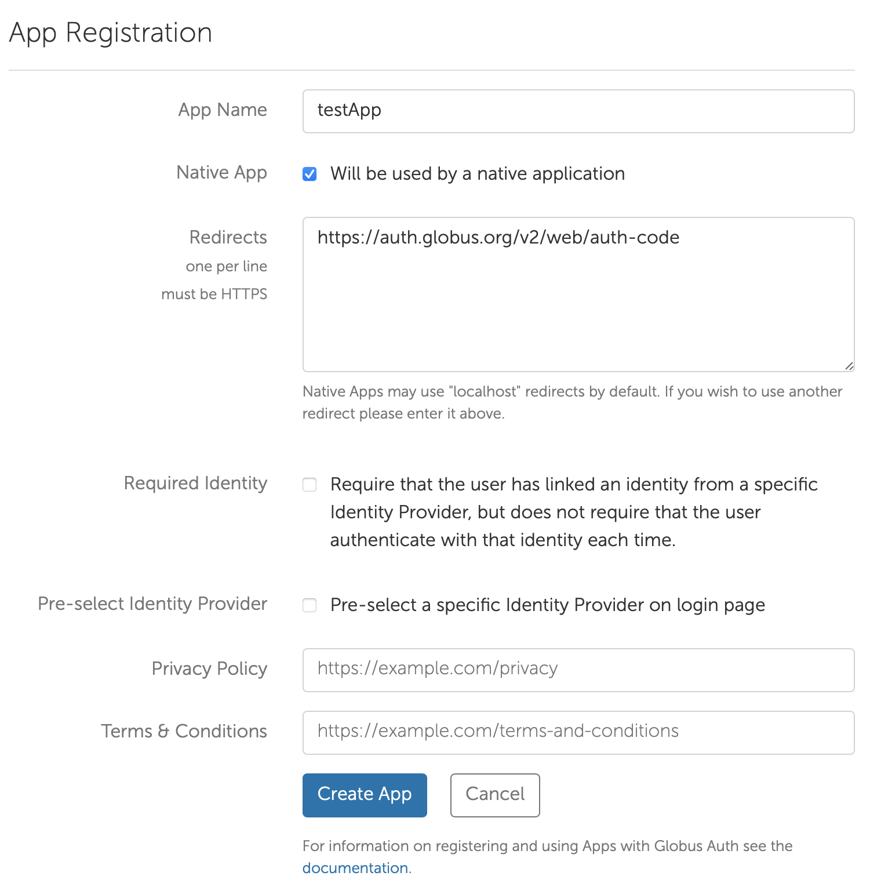

# Readme

## Step 1: Import list of target galaxies

When using this package the list of the target files must be in a .csv file with the following fields required.

- run
- rerun
- camcol
- field
- objId
- ra (degrees)
- dec (degrees)

These values can be obtained from the CasJobs service http://skyserver.sdss.org/CasJobs/.

Additional fields can be included within the .csv file but the list above details the required fields.

The .csv file must be in the same directory as the main script.

## Step 2: Create dictionary of galaxy images

SDSS imaging data is stored in the form of large survey images that are then cutout to obtain the individual galaxy images.

It is more than likely that with a large download that multiple objects of interest lie within the same survey image so therefore this only needs to be downloaded once.

By running `getSDSSDictionary.py` a dictionary of survey images to be downloaded is obtained with the key as the combination `'run rerun camcol field'`. The value of the dictionary is a list of objIds of the objects that lie within that particular survey image.

In the same directory as the script inside the `properties.csv` file `csv-filepath` needs to be replaced with the absolute file path of the .csv file containing the information about the objects to be downloaded. In addition, `download-directory` needs to be changed so that the directory where all the data is to be downloaded can be specified. This should be the absolute file path ending with a forward slash e.g. /users/abc/def/downloadFolder/

<!-- Within the file `dataCSVLocation` needs to be replaced with the absolute file path of the .csv file with the information for the objects to be downloaded. In addition, `pickleLocation` needs to be changed so that the location of the destination dictionary can be specified. **Note**: The pickle file destination needs to be noted down so that it can be used when loading in the dictionary in the download stage. -->

## Step 3: Globus initialisation

The reason why such high speeds can be achieved using this script is due to the globus data transfer service.

To utilise this service an account needs to be created and api keys need to be configured.

### Step-by-step instructions for set up

1. Visit https://www.globus.org and sign up for an account 
2. After creating an account visit https://developers.globus.org.
3. Select 'Register your app with Globus'
4. Click the 'add' button and select add new app and fill in the details as shown below, replacing testApp with an appropriate name. Once the details have been filled out click 'Create App'  
5. Now we have a way to use the api with globus. In the 'Projects' out new app should be there and when the dropdown is clicked a client id should be associated with the app
6. Now using the `globusKeySetup.py` script essential credentials can be obtained that are used to get data from the service. This script will produce the refresh token, access token and an expiry time. The access token expires after the expiry time but the refresh token will automatically obtain another api key once the time has passed. This makes the refresh token ideal for long downloads. The refresh token should be noted and should be copied into the `transfer_rt` variable within the `properties.json` file

## Step 4: Download survey images

Depending on bandwidth and cpu constraints this section can be split up into multiple processes this needs to be decided by the end user.

In the `globusDownload.py` file there are two variables named `source_endpoint_id` and `destination_endpoint_id`. These variables need to be replaced with the source and destination end point ids. The 'SDSS Public Release' source end point is `f8362eaf-fc40-451c-8c44-50b71ec7f247` and is already hard in the properties .json file.

The destination end point needs to be included to specify where the data is being transferred to. This end point can be obtained by downloading the globus client for a personal machine or when using an institution supercomputer access to the specific folder must be requested by the administrator.

## Step 5: Anaylse images

Once the survey images have been downloaded `globusAnalyse.py` can be executed to cut out the images. The script takes two parameters in the form `python3 globusAnalyse.py total_number_of_jobs job_number`. Here `total_number_of_jobs` is the amount of jobs that will execute at the same time to analyse the survey images and `job_number` is the number of the current job.

Once finished the survey images will be saved into `.npy` files and then can be loaded into the python.